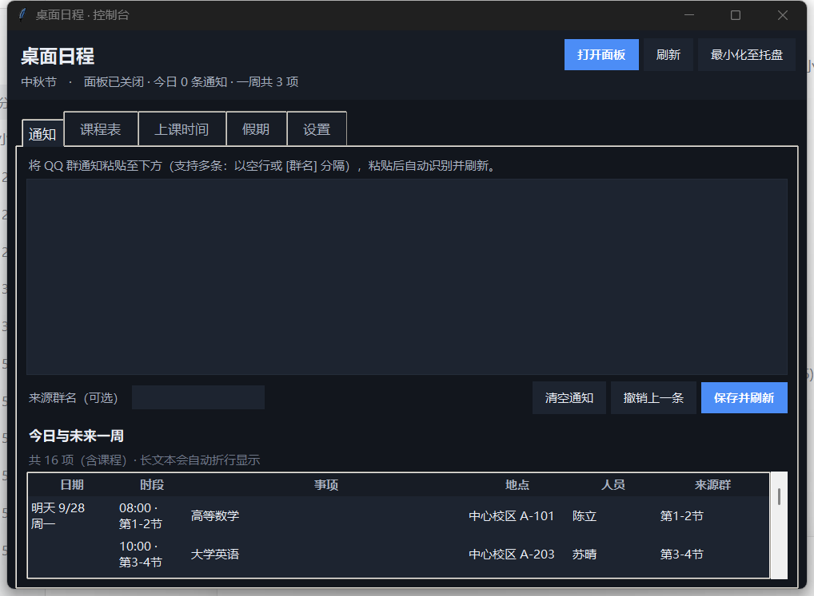
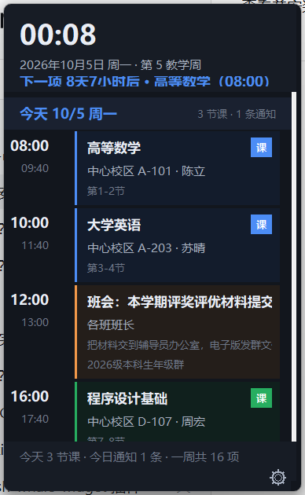

# 桌面日程 · Desktop Agenda

把 **QQ 群通知** 和 **课程表** 合并成桌面右侧的常驻时间线，再用一个**客户端控制台**管着它。
Windows / Python 标准库 / **零第三方依赖** / 自带独立运行时（拷到哪台 Windows 都能直接跑）。

## ⬇ 下载（Windows 10 / 11，64 位）

**👉 [点此下载最新版本](https://github.com/114514mbnb/desktop-agenda/releases/latest)**

在打开的页面中，于 **Assets** 区域下载便携版压缩包（`desktop-agenda-*-portable.zip`，约 15 MB）：

```
1. 下载压缩包      2. 右键 → 解压至目录（请勿在压缩包内直接双击）
3. 双击 start-client.cmd   → 桌面右侧出现日程面板，任务栏通知区出现图标
4. 若提示「Windows 已保护你的电脑」→ 更多信息 → 仍要运行
   （程序未购买代码签名证书，并非病毒；全部源码均在本仓库内可供审查）
```

**无需安装 Python**：运行时已随包提供，解压即为完整程序。

> ⚠️ **请勿点击「Code → Download ZIP」**：该入口提供的是**源代码**（不含运行时），无法直接运行；
> 可直接使用的文件仅存在于 Release 中。
>
> 📱 **不支持移动端**：本程序仅适用于 Windows 桌面系统。在手机上打开本页时，
> 右侧「Releases」入口会落至页面底部，建议直接使用上文链接。

> **首次使用请先阅读教程** → [docs/教程.md](docs/教程.md)：各功能的用法与常见问题处理均收录其中。
> 客户端内可随时打开：**设置 → 查看使用教程**（窗口内可搜索），或 `runtime\python.exe main.py --tutorial`。

- 通知：粘贴**或直接将文件拖到面板**即可识别，自动抽取**时段、地点、人员、备注**，重复项不重复入库
- **剪贴板全局热键**：在 QQ 里**选中**一条通知，按一下热键直接录入（无需先按 `Ctrl+C`）；
  可自定义、保存前自动检测冲突
- **编辑单条通知**：右键 →「编辑此条通知…」，手动微调标题 / 日期 / 时间 / 地点 / 人员 / 备注
- **给通知补备注**：先点选面板上某条通知，再按热键 —— 抓到的文字并进**那一条的备注**，
  而不是新建；没选中任何卡片时按热键才是新建
- 课表：**从文件识别**（`.ics` / 教务 PDF / 网页 / CSV / JSON / 文本）、**粘贴识别**、**手动编辑**、**导出回 WakeUp**；
  导入前均需通过**可编辑的确认窗**（双击修改、增删行、校准「第 1 教学周周一」）
- **课表体检**：一次列出节次越界、同段冲突、周次异常、课名串列等可疑之处（只检查，不改数据）
- 桌面面板：桌面组件式图层——显示桌面时浮至普通窗口之上、切换窗口时让位、**全屏运行时自动隐身**，
  且**不会因「显示桌面」或 Win+D 而消失**；只显示**有安排的日子**，过期通知自动让位
- **面板主题三种**：经典深色 / 随时刻（清晨·白天·黄昏·深夜自动换色）/ 我的照片（由照片取色生成整套配色）
- 单条日程：**右键任意一条** → 编辑通知 / 选中 / 标记为已完成 / 修改结束时间 / 复制 / 删除
- 上课时间：节数可自定义（1–24），每节课的时 / 分各一个下拉框（无需输入冒号）
- 空状态：未导入课表或近期无安排时显示**「暂无日程安排」**，并说明下一步操作
- 一条命令即可配置开机自启与每日自动整合

**隐私边界**：课表仅读取所选文件，**不登录任何系统、不接触账号密码、不联网**；
QQ 未提供开放接口，因此通知通过拖入文件或粘贴文本录入。

 

---

## 一、快速开始

> **第一次用先看教程** → [docs/教程.md](docs/教程.md)：每个功能的用法、常见问题处理都在里面。
> 客户端里随时能打开：**设置 → 查看使用教程**（窗口里可搜索），
> 或命令行 `runtime\python.exe main.py --tutorial`。

```
双击 start-client.cmd          ← 推荐：打开客户端控制台 + 桌面面板
双击 start-panel.cmd           ← 只要面板
双击 run-daily.cmd             ← 整合一次 data\inbox 后退出（给计划任务用）
tools\install.cmd              ← 装开机自启 + 每日 07:30 自动整合
tools\uninstall.cmd            ← 卸载（数据保留）
```

命令行等价写法（`runtime\python.exe` 是项目自带的 Python）：

```powershell
runtime\python.exe main.py --client --start-panel   # 客户端 + 面板
runtime\python.exe main.py --tutorial               # 打开使用教程
runtime\python.exe main.py --once                   # 整合 inbox 一次
runtime\python.exe main.py --status                 # 命令行查看一周日程
runtime\python.exe main.py --list-schools           # 看已注册的教务适配器/学校
runtime\python.exe -m unittest discover -s tests -t .   # 跑测试（554 项，约 1 分钟）
```

**为什么自带运行时**：`runtime\` 里是一份 python-build-standalone（3.13.15，来自 npmmirror
镜像，SHA256 与官方发布清单一致），只带标准库和 tkinter。这样客户端不依赖本机是否安装
Python，也不受其他工具升级影响；换电脑拷整个目录就能跑。不想要它也行：装 Python 3.11+ 后
将 `runtime\python.exe` 替换为本机 Python 即可。

---

## 二、客户端控制台

| 标签页 | 能做什么 |
| --- | --- |
| 通知 | 将群内复制的通知粘贴至输入框，**约 1 秒后自动识别**并在下方列出结果；点击「保存并刷新」正式入库，可「撤销上一条」 |
| 课程表 | 四条通道：**从文件识别** / **粘贴课表** / 手动编辑 / 导出回 WakeUp（导入前都过一遍可编辑的**确认识别结果**窗）+ 课程列表（双击编辑、Delete 删除）+ 撤销上次导入 |
| 上课时间 | **节数可自定义**（1-24）；每节课的时 / 分各一个下拉框（**无需输入冒号**）；学期开始（第 1 周周一，非周一自动校准）；一键「每节课时长相同」按第一节推算 |
| 假期 | 假期区间（这段时间不排课、群通知照收）+ 调休（那天补哪一天的课）+ 按节日预填 + 从放假通知识别 + 已结束清理 |
| 设置 | 只留日常会调的六项：启动是否显示面板、到点弹窗、**待机模式**（智能隐身 / 常驻待机）、**剪贴板热键**（自定义 + 冲突检测）、**面板主题**（经典深色 / 随时刻 / 我的照片）、数据目录。曾经放在这里的「自动整合间隔 / 面板图层 / 鼠标穿透 / 宠物模式」已按用户要求**从界面移除**（默认值就够用，要改请编辑 `data\client.json` 或用命令行开关） |

**关闭窗口 ≠ 关闭日程表**（用户明确要求）：
点控制台右上角 `X` 只把控制台**最小化至托盘**，桌面面板继续显示、提醒照常。
"完全退出"只有两个入口——托盘右键「退出应用」、面板右下角 ⚙ 齿轮（或底部状态行右键）→「退出应用（面板与托盘一并退出）」。
代码上 `ControlWindow.on_close()` 里**没有**任何 `stop_panel()` 调用，
`tests/test_import_flow.py::ClientRecoveryTests::test_closing_the_console_does_not_touch_the_panel`
盯着这条不变量（老配置里的 `close_action="quit"` 会在读配置时被降级成 `tray`）。

**控制台被藏起来之后怎么找回来**（三条路都通）：

| 方式 | 说明 |
| --- | --- |
| 再双击一次桌面快捷方式 / `start-client.cmd` | 第二次启动会写入一个请求文件，正在运行的客户端收到后即显示窗口。**不再静默退出**——早期版本的单实例保护会直接结束进程，表现为"客户端没有任何反应" |
| 双击托盘图标 | 托盘双击的默认动作是「呼出客户端窗口」 |
| 托盘右键 →「呼出客户端窗口」 | 和双击图标一样 |
| 面板右下角 ⚙ 齿轮 →「打开客户端窗口」 | 托盘图标不可用时，可从面板唤回；客户端未运行时会自动拉起 |

**托盘菜单**（右键任务栏右下角的图标）：呼出客户端窗口 / 快速录入群消息… / 打开桌面面板 /
收起桌面面板 / 立即整合群通知 / 退出应用。
托盘图标用纯 Win32 `Shell_NotifyIcon` 实现，不依赖 pystray。
图标可重新生成：`tools\make_icon.py`（需要 Pillow）。

> **实现说明（托盘菜单曾显示为空白）**：菜单项最初由 `AppendMenuW` 创建，而该 API
> **不复制字符串**，仅保存调用方传入的指针。ctypes 为 Python 字符串临时构造的
> `wchar_t*` 在函数返回后即被回收：紧随其后的 `GetMenuStringW` 仍能读回文本（该内存
> 尚未被复用，自检因此全部通过），但真正弹出绘制时内存已被覆盖，菜单只剩一条分隔线。
> 改用 `InsertMenuItemW` + `MIIM_STRING`（文档明确会复制字符串）后恢复正常。
> 此外，所有 user32 函数都补充了 `argtypes`：`DefWindowProcW` 未声明类型时，
> 64 位 `lparam` 会被按 C int 转换并抛出 `OverflowError`，窗口过程对大多数消息都在抛异常。

---

## 三、假期、调休与节日彩蛋

三件事，都在控制台「假期」页 + 面板上：

| 需求 | 实现 | 数据 |
| --- | --- | --- |
| **自定义假期时间** | 「假期」页加区间（名称 / 开始 / 结束），或粘放假通知自动识别，或按节日预填草稿 | `data/calendar.json` |
| **日期输入不许敲错** | 所有能填日期的地方都是三段式控件：年/月/日各一格，**中间的 `-` 是分隔标签，删不掉** | `agenda/date_entry.py` |
| **假期里不排课、但通知照收** | 时间线遇到假期区间就**跳过课表**，群通知不受影响 | `agenda/timeline.py` `build_timeline(calendar=…)` |
| **调休补课 + 日期旁小字** | 调休日排的是"被补的那一天"的课（周次、单双周都按那天算），日期旁边写「调休10月7日日程」 | `Makeup(date, source)` |
| **假期自动结束 + 收心倒计时** | 假期到期自动失效（不再压课/改日期行）；结束后 **3 天**内面板显示按天数递减的收心倒计时 | `Calendar.wrap_up()` / `WRAP_UP_DAYS` |
| **节日彩蛋（范围更大）** | 节日当天 + **包含该节日日期**的假期区间 + **前后各 3 天** + 假期收尾期；**只看日期，不看假期叫什么名字** | `FESTIVAL_WINDOW_DAYS` |
| **合并假期按节日分段** | 「中秋国庆连放」这类把两个节并成一条的区间，**按各节日自己的天数分段**（中秋 1 天、国庆 7 天），段外的日子恢复原样 | `agenda/festival.py` `_matching_festivals()` |
| **面板边框跟随节日主题** | 平时 1px 细边；节日期间换成节日主色、加粗到 3px，并跟着横幅动画缓慢"呼吸" | `panel._apply_festival_frame()` |

节日日期由**随包附带的农历库**推算（`agenda/lunar.py` + `agenda/vendor/lunardate.py`，
来自 [borax](https://github.com/kinegratii/borax)，MIT），覆盖**农历 1900–2100 年**：
春节/元宵/端午/中秋按农历，清明按节气。超出该范围安静地不触发，而不是猜一个错日期。
`tests/test_lunar.py` 里钉了一批可查证的历史日期（1949/1997/2000/2020/2024–2035 的春节、
1978/2000/2020 的中秋等）当回归网。

> **依赖许可说明**：PyPI 上使用最广的 `lunardate` 采用 **GPL-3.0**
> （由 GPLv2 的 `lunar` 项目改写），`zhdate` 同为 GPL。本项目以 MIT 许可开源，
> 引入 GPL 组件会使整体许可变更为 GPL。因此最终选用 MIT 许可的 borax，其源码整份
> 原样复制到 `agenda/vendor/`（保留许可证、登记版本与 SHA-256，`test_lunar.py` 里
> 有一条测试盯着这个哈希），既不装依赖、也不污染许可。

假期区间**不预置**——每年的放假安排是国务院另发的通知，程序里只给"工具 + 草稿"，
事实以学校通知为准。

装饰**不用 emoji 而是 Canvas 图元**，这是实测结论（`tools/font_probe.py`）：
Tk 8.6 在这台机器上能把 emoji 画出来，但小字号（9pt，横幅正文和彩蛋就是这个大小）
下 🧧🏮 这类新 emoji 直接变成豆腐块 —— 所以气氛交给会动的圆/线/扇形，文字只用
各字号都稳的 ★ ✦ ☾ ❁ 这类符号。`tests/test_festival.py::test_no_emoji_in_visible_text`
把这条钉住了。

```powershell
# 逐个节日截图自查（把面板的"今天"钉到每个节日，含点开彩蛋那版）
runtime\python.exe tools\capture_festivals.py
# 重拍 README 头图（面板 + 控制台，用的全是 tools/demo_data.py 里的虚构数据）
runtime\python.exe tools\capture_screens.py
# 字符渲染探针：哪些符号会画成豆腐块
runtime\python.exe tools\font_probe.py
```

全部 8 个节日的实拍截图在 `docs/festival-shots/`（每个节日两版：横幅 + 点开彩蛋），
另有假期压课、调休小字、控制台「假期」页三张效果图。

> **仓库里的每一张截图都是虚构数据**。截图工具只读 `tools/demo_data.py`
> （编出来的课表、教师、教室、群名），**不读 `data/`** —— 以前不是这样：
> 截图脚本会 `shutil.copy(data/timetable.json)`，于是 README 头图和节日效果图
> 全都带着真实课程、教师姓名、教室号，连状态栏里的本机用户名都在图里。
> 出包脚本 `tools/build_release.py` 同时改成"data/ 白名单"：只有明说允许的
> 几个文件能进 zip，其余（含 `calendar.json` 这种容易漏的）一律不放。

---

## 四、把群消息直接拖到面板上

无需先打开界面复制粘贴，直接将文件拖到桌面面板即可：

```
把 QQ 导出的群消息.txt（或整个文件夹）拖到面板上
   → 面板底部立刻显示"通知 N 条新增"
   → 时间线同时刷新
把 课表.ics / 课表.pdf 拖上去
   → 弹出可编辑的确认窗，确认后写入课表
```

| 拖进来的东西 | 会发生什么 |
| --- | --- |
| `.txt` `.md` `.text` `.log`（QQ 导出的消息） | 按通知解析入库，**GBK 编码也认**（QQ 导出常是 GBK） |
| `.html` `.htm` `.csv` `.json` | 同上，先尝试按通知文本解析 |
| 一个**文件夹** | 递归找出里面的文本文件一起解析 |
| `.ics` / `.pdf` | 按课表识别，弹出确认窗口 |
| 其他文件 | 底部提示"看不懂"，不做任何改动 |

> **实现说明**：拖放接收靠一个**单独的隐藏窗口**（`agenda/dropzone.py`）注册
> `DragAcceptFiles`，消息用 Tk 的 `after` 定时 `PeekMessage` 抽出来处理。
> 为什么不在面板窗口上直接收：那要动 Tk 自己的窗口过程，一旦处理不对就会影响
> 指针事件甚至收不到鼠标消息。另起窗口只多一个 10×10 的隐藏窗口，代价可忽略，
> 而且完全不碰 Tk。消息在 Tk 线程里处理，所以回调里能安全地更新界面。

---

## 五、课表导入：从文件识别（推荐）

> **为什么砍掉了"浏览器登录教务自动读课表"**：那条路对学校不通用，识别也不稳。
> 四所学校的实测证据见 [docs/school-reachability.md](docs/school-reachability.md)：
> 青岛大学是免客户端 WebVPN，山东建筑大学只有客户端 SSL VPN（网页根本代理不到），
> 山科/太原理工两者并存；就算进了页面，正方新版课表页一格里糊着
> `解析几何★ … 中心校区 B-103 李文明 -D0001-01 应数1班;应数2班 考试 讲课:48`，
> 解析出来全是脏字段。**文件是静态的**——格式固定、可反复解析、异常时可通过追加规则修正，
> 而且"教务系统能导出/打印课表"任何学校都成立。

### 1. 从文件识别课表（主通道）

在客户端「课程表 → 从文件识别课表…」→ 选择文件（可多选）→ 弹出**可编辑的确认窗口** → 确认导入。

| 后缀 | 来源 | 怎么解析 |
| --- | --- | --- |
| `.ics` | WakeUp 课程表导出 | 展开 `FREQ=WEEKLY;UNTIL` 求教学周（只看 DTSTART 会漏掉整学期的课） |
| `.pdf` | 教务系统打印/导出 | 按 ★ 定位课程格；iText 的 UTF-16BE + 页面 90° 旋转都处理了 |
| `.html` | 课表页"另存为" | 先按课表页结构解析，退回表格文本 |
| `.json` | 本程序的 timetable.json | 直读 |
| `.csv` `.tsv` | Excel / WakeUp 模板 | 按列名识别 |
| `.txt` `.md` | 复制粘贴保存的文本 | 按表格文本解析 |

**确认窗口中可进行的操作**（识别结果不保证完全准确，故提供核对入口）：

| 能做的事 | 怎么操作 |
| --- | --- |
| 改任意一格 | **双击**单元格就地编辑（星期是下拉框，选错会自动退回） |
| 删掉一行 | 选中行按 `Delete`，或点「删除所选」 |
| 补一行 | 点「新增一行」 |
| 校准教学周 | 改上面的 **「第 1 教学周周一」**——周次是按它算的，教务显示"第4周"而这里算成"第3周"时改这一个框就够了 |
| 放弃 | 点「取消」或按 `Esc` —— 课表**一个字都不会变** |

### 2. 粘贴课表（页面复制也行）

「课程表 → 粘贴课表…」：从 Excel / WPS / 网页 / 教务系统复制的**表格文本或整页 HTML** 都认，
走的是和文件识别同一套解析与确认窗。

### 3. 手动编辑

「课程表 → 新增课程」：课程名、星期、节次（如 `3-4`）、地点、老师、周数；
也可以双击课程列表里的任一条直接改。

### 4. 导出回 WakeUp

「导出 WakeUp CSV」生成的是 [WakeUp 课程表官方模板](https://www.wakeup.fun/doc/import_from_csv.html)，
发到手机用它的「excel导入」就能打开：

```csv
课程名称,星期,开始节数,结束节数,老师,地点,周数
高等数学,1,1,2,张三,逸夫楼101,1-5、7-11单
大学计算机,5,1,2,李四,无,1-16
```

配套工具（命令行）：

```powershell
runtime\python.exe -m agenda.file_import 课表.ics        # 先查看该文件能读出什么
runtime\python.exe tools\import_wakeup_ics.py 课表.ics   # 只看 ICS 解析结果
runtime\python.exe tools\parse_schedule_pdf.py 课表.pdf  # 只看 PDF 解析结果
runtime\python.exe tools\probe_schools.py                # 实测各校登录入口是否可达
```

---

## 六、群通知的书写格式

```
[计科2301班群]
通知：9月22日 14:00-15:30 在3号楼201会议室召开班级例会，负责人：张伟老师，请携带笔记本，提前10分钟签到。

[实验室群]
【重要】9月23日 15:00 在实验楼B302 开组会，负责人：陈静老师
备注：请提前把周报发到群里，迟到需说明原因。
```

识别出：`班级例会` / `2026-09-22` / `14:00–15:30` / `3号楼201` / `张伟` / `携带笔记本，提前10分钟签到。` / 来源群 `计科2301班群`。

| 字段 | 支持写法 |
| --- | --- |
| 日期 | 今天/明天/后天/大后天、这周五/下周三/下下周一、周五、9月22日、9/22、2026-09-22 |
| 时段 | 14:00-15:30、14点到15:30、下午3点到5点、上午9点到晚上6点、晚上8点半 |
| 半日 | 只有「上午/下午/晚上」时用该半日默认时段（如 晚上 → 19:00–21:00） |
| 地点 | 地点：xxx、在3号楼201会议室、实验楼B302、三教302、腾讯会议、学术报告厅 |
| 人员 | @某人、负责人：张老师、由X负责、联系人：X |
| 备注 | 备注/注意/须知/要求/请携带/请提前… 之后的整句 |

**不假装精准**：通知里完全没写日期时，按粘贴当天归档并标注**日期待确认**（面板红字）。

**日期约定**：`下X` = 下一个自然周的星期X。裸写的 `周三` 指最近的未来周三。

### 单条日程：右键就能处理

桌面面板上**右键某一条日程**，或控制台「通知」页下方列表里右键某一行：

| 菜单项 | 做什么 |
| --- | --- |
| **编辑此条通知…** | 手动微调识别结果：标题 / 日期 / 开始 / 结束 / 地点 / 人员 / 备注 |
| **选中此条** | 把这条件为"当前选中"；之后按热键抓到的文字会**并进它的备注** |
| **标记为已完成** | 事项办结后该条从日程中移除（面板立刻刷新） |
| **修改结束时间…** | 弹出「时:分」下拉框的小窗（**无需输入冒号**），修改后立即生效 |
| **复制内容** | 标题/时间/地点/人员/备注一行复制到剪贴板 |
| **删除此条…** | 彻底删掉（会问一次） |

- **通知**：编辑 / 改结束时间直接写 `events.json`；标记完成/删除就是把它移出去。
- **课程**：改结束时间只给**这一条**写一个 `endTime` 覆盖值，
  **不动全校课时表**（课时表是作息，改它会连带影响所有课）；「编辑此条通知…」对课程是灰的。
- 面板**空白处**右键才是全局菜单（整合通知 / 快速录入 / 收起 / 退出）；卡片上是这一条的菜单；
  **底部那一行状态提示**右键又是一套（打开客户端 / 快速录入 / 立即整合 / 刷新 / 收起 / **退出应用**）。
- **点一下卡片**即选中（整张卡任意位置都能点，含时间列与备注文字），再点一下取消；
  取消选中时跟着打开的详情窗会一并关闭。**双击**卡片弹出全文详情窗（全局只保留一个）。

### 删掉不想留的通知

| 操作 | 位置 | 说明 |
| --- | --- | --- |
| 删最近录入的一条 | 通知页 →「撤销上一条」 | 删之前会问一次 |
| 删全部 | 通知页 →「清空通知」 | **课程表不受影响**；清空前自动备份至 `data\events.cleared-<时间>.json` |
| 从源头避免 | 不要在 `data\inbox\` 中放置示例文件 | 文件名含 `示例/样例/例子/示范/demo/sample/example/test` 的**一律不解析**（见下） |

> **为什么会多出没见过的日程**：项目早期在 `data\inbox\` 放了一份 `示例通知-可替换.txt`
> 做演示，结果它被当成真通知解析成了"开组会""讲座"并显示在面板上——会被误认为程序在自行编造日程。
> 现在有两条防线：① 这类文件名直接跳过，不再解析也不归档（文件保留在原处，是否删除由使用者决定）；
> ② 通知页提供「清空通知」，清空前自动备份。**课程表与通知是两个独立的库，互不影响。**

---

## 七、扩展点：新增教务适配器

新增**一套教务系统** = 加一个适配器类 + 一行注册：

```python
# agenda/eas/myschool.py
from .base import AdapterInfo, EasAdapter, FetchResult
from .registry import register

@register
class MySchoolAdapter(EasAdapter):
    info = AdapterInfo(key="myschool", title="某某教务", homepage="https://jw.example.edu.cn")

    def login_url(self) -> str:
        return self.absolute("/login")

    def login_fields(self, username: str, password: str) -> dict[str, str]:
        return {"user": username, "pass": password, "csrf": "..."}   # 按目标学校的表单字段填写

    def fetch_courses(self) -> FetchResult:
        html = self.session.open(self.absolute("/kbcx/xskbcx.html"))
        return self.parse_payload(html)   # 可复用 zfsoft 的解析工具
```

新增**一所学校** = 在 `agenda/eas/registry.py` 的 `SCHOOLS` 里加一条（名字 + 适配器 + 网址）。

已提供的可复用零件：`parse_weeks` / `format_weeks`（单双周）、`find_inputs`（表单隐藏字段）、
`parse_tables`（不依赖 bs4 的表格解析）、`_weekday_from_text`、`_periods_from_text`。
**欢迎把学校网址或教务页面结构发我，我加进目录。**

---

## 八、数据文件与目录结构

```
desktop-agenda/
  main.py                 入口：--client / --once / --status / --paste / --list-schools
  runtime/                自带的 Python 3.13（自给自足，可删掉换系统 Python）
  agenda/
    models.py             事件模型与一周记忆窗口
    parsing.py            中文日期/时段解析（纯规则，不联网）
    extract.py            通知 → 结构化事项（标题/地点/人员/备注）
    timetable.py          课表读取、周次展开、节次时间表
    lunar.py              农历/节气换算（包装 vendored 的 lunardate，覆盖 1900–2100）
    vendor/               随包附带的第三方组件（borax lunardate，MIT，含许可证）
    holidays.py           假期区间 + 调休（data/calendar.json），假期压课、调休补课
    holiday_parse.py      从放假通知原文里认出假期与调休（含"补哪天的课"）
    festival.py           节日日期表（2024–2035）+ 每个节日的配色/文案/装饰图元
    festival_banner.py    面板顶部的节日横幅（Canvas 装饰动画 + 点开彩蛋）
    store.py              JSON 存储、指纹去重、过期清理
    timeline.py           时间线视图模型（WakeUp 风格版式，含假期/调休/节日）
    panel.py              桌面常驻面板（tkinter + Win11 细节）
    control_window.py     客户端控制台（通知/课程表/上课时间/假期/设置）
    client_app.py         客户端控制器：面板进程启停、设置、导出
    client_config.py      客户端设置（data/client.json）
    tray.py               托盘图标（纯 ctypes 调 Shell_NotifyIcon）
    theme.py              配色、字体、Win11 DPI/圆角
    palettes.py           面板主题的调色板（经典深色 / 随时刻四段 / 我的照片）
    backdrop.py           照片背景：GDI+ 解码 → 取色 → 生成 PNG（零第三方依赖）
    hotkey.py             全局热键（登记/冲突检测）+ 剪贴板读写 + 抓前台选区
    date_entry.py         三段式日期输入（中间的短横线删不掉）
    timetable_check.py    课表体检：节次越界、同段冲突、周次异常、课名串列
    browser.py            浏览器自动化（纯标准库 WebSocket + CDP，现在只给排错工具用）
    dropzone.py           拖放接收：拖文件到面板上就自动提取（隐藏窗口 + WM_DROPFILES）
    tutorial.py           使用教程窗（把 docs/教程.md 渲染成可搜索的窗口）
    file_import.py        从文件识别课表：.ics/.pdf/.html/.json/.csv/.txt → 行结构
    course_review.py      确认识别结果窗（双击改格、增删行、改第 1 教学周周一）
    winlayer.py           Win32 桌面图层：置底、鼠标穿透、全屏探测
    eas/                  教务适配器框架（直连式，供其他学校扩展）
      base.py             HTTP 会话、HTML 解析、适配器基类
      zfsoft.py           正方教务适配器（覆盖最广；含新版课表页的脏字段清洗）
      files.py            WakeUp CSV / Excel 粘贴 / 课表网页
      registry.py         适配器注册表 + 学校目录
      importer.py         落盘 timetable.json（带备份/回退）
    pipeline.py           一次完整跑批：扫描 → 解析 → 合并 → 归档 → 清理
  tests/                  554 项测试（解析、去重、课表、时间线、适配器、导入流程、正方脏字段清洗、
                          课时表校验、示例文件防线、拖放接收、控制台找回、单条日程操作、通知编辑与补充、
                          剪贴板热键与修饰键处理、面板主题、课表体检、节日彩蛋与合并假期分段、
                          面板贴顶与过期让位、教程渲染、界面精简/齿轮入口、CDP 帧、
                          窗口图层/最小化防护/滚动条/截图不隐身、空状态、冒烟、静态闸门）
  tools/                  install / uninstall / launch-panel.vbs / make_icon.py / capture_panel.py
                          probe_schools.py（实测各校登录入口）/ parse_schedule_pdf.py / import_wakeup_ics.py
                          demo_data.py（截图专用虚构数据）/ capture_screens.py（README 头图）/ capture_festivals.py
  docs/教程.md            使用教程（面向用户；客户端「设置 → 查看使用教程」看的就是它）
  docs/school-reachability.md  四所学校入口的实测记录（为什么砍掉浏览器导入）
  data/                   ← 用户数据均位于此：events.json、timetable.json、client.json、inbox/
```

`data/` 全部是可读 JSON：想手改、备份、删掉重来都行。

清空课表有两条路：控制台「课程表 → 清空课程表」按钮（会先自动备份，可随时「撤销上次导入」），
或者直接删掉 `data/timetable.json`。**清空后**面板和控制台都会显示
**「暂无日程安排」**，并说明下一步该从哪里导入：

| 情况 | 面板显示 |
| --- | --- |
| 未导入课表、也没有通知 | 中间一句「暂无日程安排」+「尚未导入课表：请于客户端「课程表 → 从文件识别课表…」导入」 |
| 一周内有通知、某天无安排 | 那天**不再占版面**：面板只列有安排的日子（今天始终保留，它是时间线的锚点） |
| 整周都没有课和通知 | 只显示一次空状态，不再铺七个空日期头 |
| 今天已经过去的那条通知 | 不再显示（面板只回答"接下来要做什么"）；控制台仍保留当天全部通知 |

---

## 九、面板图层与待机模式

面板**不会**因为"显示桌面"、`Win+D`、或任务栏右下角那个按钮而消失——那正是用户报过的问题。
面板仅在三种情况下隐藏：手动收起、客户端关闭、或有**持续**全屏的应用在前台（智能隐身模式下临时隐身；
常驻待机则不会隐藏）。**有弹窗开着时不隐身**，一闪而过的全屏窗口也不会触发。

| 行为 | 实现 | 实测证据 |
| --- | --- | --- |
| 显示桌面时**浮到普通窗口最上层** | `SetWindowPos(HWND_TOP)`（宠物模式） | 实测面板可见、仍非置顶 |
| **不可能被最小化** | `SetWindowSubclass` 拦 `SC_MINIMIZE` → 换成"显示但不激活" | 发 `SC_MINIMIZE` 后 `IsIconic` 仍为 False |
| 万一还是被最小化 → 自动还原 | 前台快查里顺便探测 `IsIconic`，是就 `ShowWindow(SW_RESTORE)` | 强制 `SW_MINIMIZE` 后能救回 |
| 切换到其他窗口时正常让位 | 不设 `WS_EX_TOPMOST` | 扩展样式置顶位为 0 |
| 不抢焦点（不把游戏切后台） | `WS_EX_NOACTIVATE` | 样式位断言通过 |
| 全屏应用时自动隐身 | 每 40 ms 探测前台窗口是否全屏（**智能隐身**模式） | `winlayer.fullscreen_foreground()` |
| **有自己弹的窗时不隐身** | 详情窗 /「编辑此条通知」/「修改结束时间」开着就跳过隐藏 | `panel._has_open_dialog()` |
| **一闪而过的全屏不算** | 覆盖全屏要**持续 1.5 秒**才认定；截图工具的遮罩正好是"覆盖全屏、位于左上角"的窗口 | `FULLSCREEN_GRACE_MS` |
| 常驻待机（全屏也不让位） | 同一条判断直接跳过（**常驻待机**模式） | `desktop_only=False` |
| 仅在手动收起后才真正隐藏 | 右键菜单「收起面板」/「收起 1 小时」，或客户端「关闭面板」 | `_user_hidden` 标记，监控不会把它拉回来 |

**待机模式**（设置里二选一，用户点名要的两个方案）：

| 模式 | 配置 | 行为 |
| --- | --- | --- |
| **智能隐身** | `desktop_only=True` | 检测到全屏应用（游戏/视频）时让位，切回桌面立刻恢复；面板按定时器持续刷新 |
| **常驻待机** | `desktop_only=False` | 全屏运行其他应用时面板**也不隐藏**，始终留在屏幕上 |

**恢复是"瞬间"的**：三件事都做了才快——
① 隐身/恢复不是 `withdraw()` + `deiconify()`（那要等下一次刷新才重画），而是**把窗口挪到屏幕外 / 挪回来**，恢复就是一次 `SetWindowPos`；
② 前台状态改成 **40 ms 一次的廉价快查**（先是 2500 ms，后来 100 ms；两个探测加起来 0.002 ms/次）；
③ 解锁 / 显示器重新点亮 / 分辨率变化这几个事件由系统**主动发消息**到面板窗口，
用 `SetWindowSubclass` 在 Tk 自己的消息循环里接住就立即恢复，不再等轮询。

实测（`tools/_restore_probe.py` 量出来的）：从"切回桌面"到面板出现，
100 ms 那版平均 **102 ms**（明细 103/101/101/101/104），40 ms 这版平均 **40 ms**；
解锁/亮屏那条路因为走消息回调，是**当帧**恢复。
`tests/test_winlayer.py::PanelWakeHookTests` 用一条真实的 `WM_POWERBROADCAST` 钉住了这条链路。

> **为什么不用 `SetWinEventHook` 做事件驱动**：试过，**会崩**。
> `SetWinEventHook(EVENT_SYSTEM_FOREGROUND, WINEVENT_OUTOFCONTEXT, ...)` 注册的
> ctypes 回调是**由系统的窗口事件线程直接调用**的，那个线程没有 CPython 的 GIL，
> 回调里一碰 Python 对象进程就当场死：
> `Fatal Python error: PyEval_RestoreThread: ... the current Python thread state is NULL`（实时复现过）。
> 而 `SetWindowSubclass` 的回调是**本项目自身的消息循环**在派发消息时调用的，同一个线程、有 GIL，安全
> —— 上面第 ③ 条走的就是这条路。


> **为什么必须在消息层拦最小化**：面板是 `overrideredirect + WS_EX_TOOLWINDOW`
> （不进 Alt+Tab、没有任务栏按钮）。一旦被最小化，**没有任何入口能把它还原**——
> 点任务栏找不到它。轮询里再 `ShowWindow` 也救不回来，因为在此期间窗口已不存在。
> **实现说明**：早期 `_desktop_watch` 仅调用 `send_to_bottom`，而面板本就位于最底层，
> 该调用等同于空操作，导致按下 Win+D 后反而被其他窗口覆盖。

**滚动流畅性**：卡片控件带缓存（内容没变就复用，只重画进度条），
一次刷新从 **273 ms 降到 3.4 ms**；滚轮事件统一在 root 上收，卡片不再各绑一次
`<Configure>`（原来滚动时会触发几十个回调，这就是"滚轮很卡"的来源）。
右侧还有一条深色滚动条（滑块颜色比面板底亮一档，不然看不见）。

切换：客户端 **设置 → 待机模式**（智能隐身 / 常驻待机）。保存后会询问是否立即重启面板。

**其余图层开关已从界面移除**（用户要求：设置页只留日常会调的项）。它们仍然生效，
值来自 `data\client.json` 或命令行开关：

| 开关 | 配置字段 | 默认 | 怎么改 |
| --- | --- | --- | --- |
| 面板图层 | `window_mode`（`desktop` / `topmost`） | `desktop` | 改 JSON，或 `--window-mode topmost` |
| 鼠标穿透 | `click_through` | `false` | 改 JSON，或 `--no-click-through` |
| 桌面宠物模式 | `pet_mode` | `true` | 改 JSON，或 `--no-pet-mode` |
| 自动整合间隔 | `pipeline_minutes` | `15.0` | 改 JSON，或 `--pipeline-minutes N` |

> **鼠标穿透默认关闭**：开启后面板不响应鼠标，用户会误判为程序失效（实测反馈如此）。
> 界面中的对应勾选框也因此移除：实际使用中只会被误开，从无主动开启的需求。
> 需要时改 `data\client.json` 里的 `"click_through": true` 并重启面板。
>
> **保存设置不会覆盖这几个字段**：`ControlWindow.save_settings()` 只写界面上还留着的那几项，
> 其余保持"配置文件里的原值或默认值"。`tests/test_settings_ui.py::SettingsPageTests::
> test_power_settings_keep_their_config_values` 盯着这条不变量。

**关于"不显示桌面时"**：面板进程常驻（否则每天自动整合、到点提醒都会停），
但它只在桌面这一层显示、智能隐身模式下全屏时隐藏，几乎不占资源。若要彻底停掉，用控制台的「关闭面板」——
托盘客户端继续负责收通知和提醒。

---

## 十、常见问题

| 现象 | 处理 |
| --- | --- |
| **客户端打不开** | 程序仍在运行，只是窗口被最小化至托盘。**再次双击桌面快捷方式**（`start-client.cmd`）即可唤回窗口；也可双击托盘图标，或托盘右键 →「呼出客户端窗口」。 |
| 文件提示「未能识别课表」 | 先用命令行检查：`runtime\python.exe -m agenda.file_import 课表文件`，会打印读取到哪些内容、卡在哪一步 |
| 读到课但字段缺（教师/地点空着） | 确认窗里双击补上即可；也可将文件反馈给作者以补充解析规则 |
| 周次与教务不一致 | 在确认窗口上方修改 **「第 1 教学周周一」**——周次按它推算，改一处即可，无需逐条调整。WakeUp 的 `.ics` 仅记录绝对日期，学期第 1 周需由使用者指定 |
| 识别结果有误 | 在确认窗口中双击修改；点击「确认导入」才会写入课表，点击「取消」不做任何改动 |
| 面板被别人挡住 | 面板默认钉在桌面层（不置顶）；想让它总在最前，设置里把「显示等级」改成置顶 |
| 面板挡不住鼠标 / 点不到 | 在设置中关闭「鼠标穿透」，或双击托盘图标重新打开 |
| 课表读到一半 | `runtime\python.exe main.py --check-timetable` 逐条列出读到什么 |
| 放假了却还在排课 | 控制台「假期」页加一段假期区间（或粘放假通知让它自己认） |
| 调休那天排的是平时的课 | 「假期」页加一条调休：调休日 + 补哪天的课 |
| 节日没有彩蛋 | 节日**当天**一定有；想让整个假期都有，把假期区间配上（名称要和节日一致） |
| 想给别的学校做适配 | 先跑 `runtime\python.exe tools\probe_schools.py` 看那所学校的入口是什么形态；直连式适配器写法见第五节 |

---

## 十一、许可与来源

- 本项目 **MIT**，见 [LICENSE](LICENSE)
- 课表 CSV 模板格式来自 [WakeUp 课程表官方文档](https://www.wakeup.fun/doc/import_from_csv.html)，
  仅对齐格式，**不含 WakeUp 的任何代码**（WakeUp 本身闭源，官方无开源仓库）
- 运行时是 [python-build-standalone](https://github.com/astral-sh/python-build-standalone) 的官方构建
- **第三方组件（vendored，随包附带、无需安装）**：
  - [`borax`](https://github.com/kinegratii/borax) 的 `borax/calendars/lunardate.py`（农历/节气换算）
    → `agenda/vendor/lunardate.py`，**MIT**，Copyright (c) 2015-2025 kinegratii，
    许可证见 `agenda/vendor/LICENSE-borax.txt`；版本 4.1.3，原样复制未修改，
    SHA-256 记录在 `agenda/vendor/__init__.py` 并由 `tests/test_lunar.py` 校验
- 通知解析、时间线、面板、客户端、假期/调休、节日彩蛋均为本项目原创实现；
  除上面这一个 vendored 模块外**零第三方运行时依赖**

## 十二、参与贡献

| 想做什么 | 从哪下手 |
| --- | --- |
| 加一所学校的教务适配器 | `agenda/eas/` 加一个类 + 一行注册；先跑 `tools/probe_schools.py` 看那所学校的入口形态 |
| 某个课表文件识别不了 | 把文件发到 Issue，加一条解析规则（`agenda/file_import.py`） |
| 通知解析不准 | `agenda/extract.py`，测试在 `tests/test_parsing.py`（含真实案例） |
| 改界面/面板 | `agenda/panel.py`（图层与性能）、`agenda/control_window.py`（控制台） |
| 改节日彩蛋 | `agenda/festival.py`（文案/配色/装饰）、`tools/capture_festivals.py` 出效果图 |
| 升级农历库 | 整份覆盖 `agenda/vendor/lunardate.py` → 更新 `__init__.py` 里的版本与 SHA-256 → 跑 `tests/test_lunar.py` |

跑测试：`runtime\python.exe -m unittest discover -s tests -t .`（554 项，约 1 分钟）

写代码时请留意两条约定：
1. **不引入第三方运行时依赖**——只用标准库，换电脑零配置
2. **把经验沉淀进注释与测试**：代码中存在大量"为什么不能这样写"的注释，用于避免同类问题重复出现
