# 桌面日程 · 使用教程

**一句话**：它把 QQ 群里的通知和你的课表，合成桌面右边那条时间线。
全部在本机完成，**不联网、不要账号密码、不读聊天记录**。

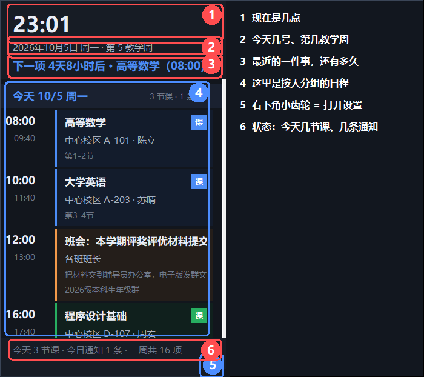

---

## 目录

1. [它是干什么的](#1-它是干什么的)
2. [五分钟上手](#2-五分钟上手)
3. [桌面面板怎么用](#3-桌面面板怎么用)
4. [把课表导进来](#4-把课表导进来)
5. [把群通知加进来（五种方式）](#5-把群通知加进来五种方式)
6. [处理单条日程：右键](#6-处理单条日程右键)
7. [上课时间与节数](#7-上课时间与节数)
8. [假期、调休与节日彩蛋](#8-假期调休与节日彩蛋)
9. [设置项逐个说明](#9-设置项逐个说明)
10. [窗口找不到了怎么办](#10-窗口找不到了怎么办)
11. [数据在哪、怎么备份、怎么恢复](#11-数据在哪怎么备份怎么恢复)
12. [常见问题](#12-常见问题)
13. [命令行参数](#13-命令行参数)

---

## 1. 它是干什么的

它干两件事：

| 它做的 | 说明 |
| --- | --- |
| **把群通知变成日程** | 粘一段群消息进来，它自动认出时间、地点、人员、备注，排进时间线，一周内自动去重 |
| **把课表铺到每一天** | 导入课表文件（WakeUp `.ics`、教务 PDF、网页、CSV 都行），按上课时间展开到每一天 |

它**不做**这些：

- 不读 QQ 聊天记录（QQ 没有开放接口，所以通知靠你粘、拖、或按热键录）
- 不碰教务账号密码（课表靠**文件**识别）
- 不联网

### 三个窗口，认清它们

| 窗口 | 长什么样 | 干什么 |
| --- | --- | --- |
| **日程表**（也叫"面板"） | 桌面右边那条，一直待着 | 看日程、处理单条日程 |
| **控制台** | 点面板右下角齿轮才出来 | 改设置、导课表、录通知 |
| **教程**（就是这个窗） | 你现在看的 | 说明文档，能搜索 |

### 记住这三件事，就不会懵

1. **双击桌面「桌面日程」只会打开日程表**，不会弹控制台。
2. **要改设置就点日程表右下角那个小齿轮**（下面有特写图）。
3. **关掉控制台窗口不等于关掉日程表**。关掉只是把它收到托盘，日程表照常在。

看不懂命令行、忘了某个按钮在哪？控制台**顶栏**就有一个 **「使用教程」** 按钮（一点就开）；
「设置」页 **「帮助」** 那一块也有 **「查看使用教程」**，
随时能把这份文档打开（能搜索、能跳章节）。

**想要更大更清楚的图、或者想收藏这一页**：教程窗右上角点 **「在浏览器打开」** ——
它会生成 `docs/教程.html` 并用系统浏览器打开，那版每章是一张卡片、**图可以点开放大**，
也能用浏览器的收藏与页内查找（Ctrl+F）。

---

## 2. 五分钟上手

### 第一步：打开

双击桌面上的 **「桌面日程」**。桌面右边会出现那条日程表。

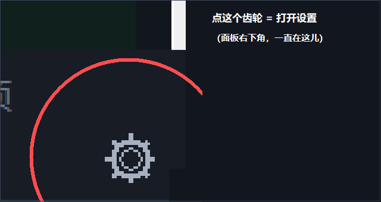

点那个齿轮，菜单第一项就是 **「日程表设置…」**：它会把控制台叫出来，并直接停在「设置」页。

### 第二步：把课表导进来

1. 点齿轮 → 控制台出现，停在**「课程表」**页
2. 点 **「从文件识别课表…」**，选你的课表文件
3. 弹出**确认窗**，核对一遍 → 点 **「确认导入」**

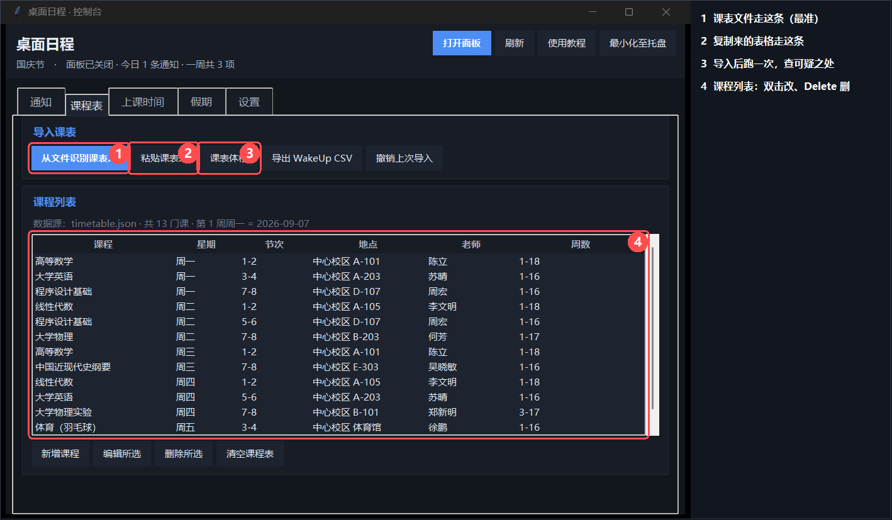

详细操作见 [第 4 节](#4-把课表导进来)。

### 第三步：把通知加进来

最快的办法：**在 QQ 里选中那条通知文字，按一下热键**（默认 `Ctrl+Alt+Q`）。
面板底部会告诉你了什么。

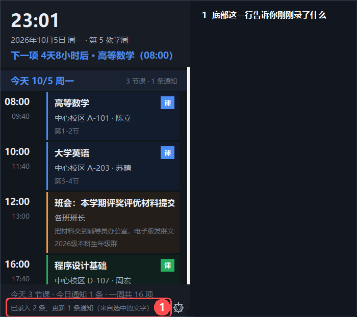

其他办法见 [第 5 节](#5-把群通知加进来五种方式)。

### 第四步：设成开机自启（可选）

控制台 →「设置」→ 勾上 **「开机后自动打开日程表面板」**。以后开机它就自己出来。

> 只想在需要时手动开：双击项目目录里的 `start-panel.cmd`。

---

## 3. 桌面面板怎么用

### 从上到下是什么

| 位置 | 是什么 |
| --- | --- |
| 顶部大数字 | 现在几点 |
| 下面一行 | 今天几号、第几教学周（假期另说） |
| 再下面一行 | **下一项**：最近的一件事还有多久 |
| 中间 | 按天分组：每天有哪些课、哪些通知 |
| 最下面一行 | 状态：今天几节课、几条通知、上次整合时间；临时提示也在这儿 |
| 右下角 | **齿轮** = 打开设置 |

### 能做的操作

| 想干什么 | 怎么做 |
| --- | --- |
| 看某条的全文 | **双击**那张卡片 |
| 选中某条 | **单击**卡片任意位置；再点一下取消 |
| 处理某条 | **右键**那张卡片 → 菜单（见 [第 6 节](#6-处理单条日程右键)） |
| 翻页 | 滚轮，或拖右边那条细滚动条 |
| 移动面板 | 按住**顶部标题区**或**面板空白处**拖动。松手就记住位置，下次启动还在那儿 |
| 改宽度 | 拖右下角，或拖右侧/下侧的隐藏边缘 |
| 打开设置 | 点右下角 **⚙** |
| 全局菜单 | 在面板**空白处**右键 |

### 面板上几条规矩

- **时间线永远从最上面开始**：最早的在最上，不会停在中间。
- **只显示有安排的日子**：某天既没课也没通知就不占地方（今天例外，它是锚点）。
  一周都没安排时，只画一句 **「暂无日程安排」**。
- **过期的通知自动让位**：时间过了的群通知不再占版面；**课程不受影响**（上午的课下午还要回看）。
- **「下一项」显示完整**：一行放不下就折行，不把标题切一半。
- **面板不会因为什么而消失**：点"显示桌面"、按 `Win+D` 都不消失；只有全屏应用（游戏/视频）在前台时会临时隐身，切回来自动回来；或者你自己右键「收起面板」。

---

## 4. 把课表导进来

控制台 →「课程表」页。

### 4.1 从文件识别（推荐）

点 **「从文件识别课表…」**，可以多选。认得的格式：

| 后缀 | 从哪来 |
| --- | --- |
| `.ics` | WakeUp 课程表 → 导出（**最准**，含绝对日期） |
| `.pdf` | 教务系统打印/导出的课表 |
| `.html` `.htm` | 课表网页"另存为" |
| `.csv` `.tsv` | Excel / WPS / WakeUp 模板 |
| `.json` | 本程序自己的 `timetable.json` |
| `.txt` `.md` | 直接复制出来的课表文字 |

### 4.2 确认这一步不能跳过

识别只是"猜"，所以程序**不会直接覆盖**你的课表，而是先弹确认窗给你看。

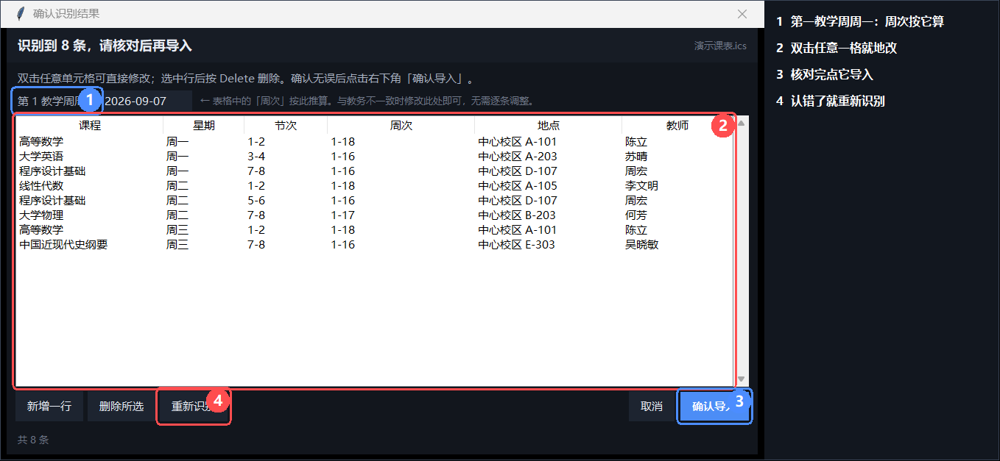

| 要改什么 | 怎么改 |
| --- | --- |
| 某一格写错了 | **双击那一格**，就地改 |
| 多了一行 | 选中这行按 `Delete`，或点「删除所选」 |
| 少了一行 | 点「新增一行」 |
| 全都认错了 | 点「重新识别」 |
| 不想导了 | 点「取消」或按 `Esc`——课表**一个字都不会变** |

窗口上方有个 **「第 1 教学周周一」**，**周次是按它算的**。
教务写"第 4 周"、程序算成"第 3 周"？改这一个框就对齐了，不用逐行改。

### 4.3 粘贴课表

点 **「粘贴课表…」**：从 Excel / WPS / 网页 / 教务复制的表格文本或整页 HTML 都认，
一样会过确认窗。

### 4.4 手动增删改

- **「新增课程」**：填课程名、星期、节次（如 `3-4`）、地点、老师、周次
- 课程列表里**双击**任意一条就能改
- 选中后按 `Delete` 删除
- **「清空课程表」**：清空全部（会自动备份，能「撤销上次导入」）

### 4.5 导出回手机

点 **「导出 WakeUp CSV」**，把生成的文件发到手机上，用 WakeUp 的"excel导入"打开。

### 4.6 导入后跑一次「课表体检」

识别偏差不会报错，只会安静地少一门课、把周次读成节次。点 **「课表体检」**，
它把可疑之处一次列出来，分 **✗ 问题** 和 **⚠ 建议核对** 两级。

它能查：节次超出上课时间表、结束节次小于开始节次、同一时段两门课、课名里混进教务字段、
周次异常、完全重复的行、同一门课同时有单周和双周、缺地点/教师/周次、没设「第 1 教学周周一」。

结果窗可以**复制报告**或**保存为文件**。体检**只检查，不会自动修改课表**。

### 周次怎么写

| 写法 | 意思 |
| --- | --- |
| `1-16` | 第 1 到 16 周，每周都上 |
| `1-5、7-11单` | 1~5 周，加上 7~11 周的**单周** |
| `2-8双` | 2~8 周的**双周** |
| 留空 | 每周都上 |

---

## 5. 把群通知加进来（五种方式）

五条路，挑一条顺手的。

### 方式一：把消息文件拖到面板上（最省事）

把 QQ 导出的消息存成 `.txt`，**直接拖到桌面面板上**：

- 底部显示「通知 N 条新增」
- 时间线立刻刷新
- 拖**整个文件夹**也行，会递归找里面的文本文件
- 拖 `.ics` / `.pdf` 会按课表识别
- 拖别的文件 → 底部说认不出来，什么都不改

QQ 导出的文件常是 GBK 编码，**也认**。

### 方式二：粘贴（最直接）

控制台 →「通知」页 → 把群消息粘到上面那个大框 → 点 **「保存并刷新」**。

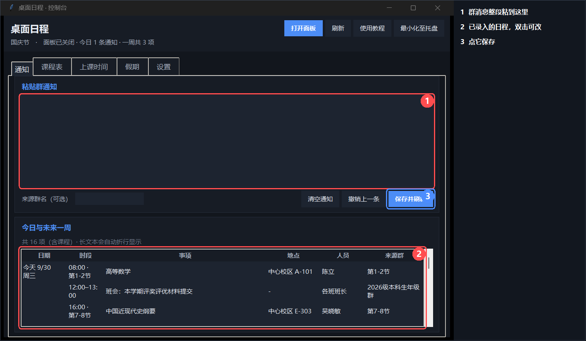

- 一次可以粘**多条**，用空行或 `[群名]` 开头分隔
- 「来源群名」可填可不填（消息里写了 `[群名]` 就以它为准）
- 粘完约 1 秒下面出现识别结果，**可以逐条改**
- 填完按 `Ctrl+Enter` 也能保存
- 右边还有 **「清空通知」**（清掉全部）和「撤销上一条」

### 方式三：快速录入小窗

面板空白处右键 →「快速录入群消息…」：叫出一个小窗，粘上就能存。

### 方式四：剪贴板全局热键（最快）

**在 QQ 里选中通知文字，直接按热键**（默认 `Ctrl+Alt+Q`）。不用先按 `Ctrl+C`。

程序会：读到选中的文字 → 解析 → 入库 → 在面板底部告诉你了什么（见上面那张图）。

- **抓不到选中内容时会退回读剪贴板**，并在提示里写明「来自剪贴板（没抓到选中的文字）」，免得你以为识别错了。
- **终端窗口会自动跳过**（那里 `Ctrl+C` 是中断信号，可能打断你正在跑的命令）。
- **改热键**：控制台 →「设置」→「剪贴板热键」→ 在输入框里**直接按下想用的组合** → 点「检测并保存」。**不用重启面板**。
- **组合规则**：必须带 `Ctrl` / `Alt` / `Win` 中至少一个。只带 `Shift` 的（比如 `Shift+Z`）会被拒绝——你一打大写字母就会触发它。
- **冲突检测**：保存前会试登记一次；被别的程序占了会直接说「这个组合已经被别的程序占用了」，不会出现"保存成功但按下没反应"。
- **热键由日程表注册**：面板没在跑时热键不可用（设置页会提示）。

### 方式五：收件箱（批量/自动）

把 `.txt` 丢进 `data\inbox\`，然后：

- 等面板自动整合（默认每 15 分钟），或
- 面板右键 →「立即整合群通知」，或
- 跑一次 `run-daily.cmd`

整合过的文件自动移到 `data\archive\`。
（文件名里有 `示例`/`demo`/`sample`/`test` 的会被跳过。）

### 通知怎么写才认得出

这样写最准：

```
[群名]
通知：9月25日 14:00-15:30 在3号楼201会议室召开班级例会，负责人：张伟老师，请携带笔记本。
```

| 字段 | 支持的写法 |
| --- | --- |
| **日期** | 今天 / 明天 / 后天 / 这周五 / 下周三 / 周五 / 9月25日 / 9/25 / 2026-09-25 |
| **时段** | 14:00-15:30、14点到15:30、下午3点到5点、上午9点、**今天中午12:00前** |
| **地点** | 在3号楼201会议室、实验楼B302、三教302、腾讯会议、线上 |
| **人员** | 负责人：张伟老师、@王强、联系人：陈静、由X负责 |
| **备注** | `备注：…`、`请携带…`、`请提前…` 后面的整句 |

**完全没写日期的**：按粘贴当天归档，并标红「日期待确认」——它不猜。

**写了区间又写了「每日」的**（例：`9月25日-28日期间，每日上午11:00前统计…`）：
只记**一条**，落在区间的**最后一天**，备注写明「连续事项：09月25日–09月28日 每日（09月28日 截止）」。
不摊成 4 条，是因为这类事本质上是"一条有截止日的事"，摊开会把空闲日子填满同名卡片。

---

## 6. 处理单条日程：右键

**右键面板上任意一张卡片**（控制台「通知」页下面的列表也行）：

| 菜单项 | 做什么 |
| --- | --- |
| **编辑此条通知…** | 手动改识别结果：标题 / 日期 / 开始 / 结束 / 地点 / 人员 / 备注 |
| **选中此条（下次按热键 = 补充备注）** | 之后按热键拿到的那段文字，会并进这条的备注，而不是新建一条 |
| **标记为已完成** | 事办完了，这条从日程里消失 |
| **修改结束时间…** | 弹出小窗，时 / 分各一个下拉框 |
| **复制内容** | 标题 / 时间 / 地点 / 人员 / 备注一行进剪贴板 |
| **删除此条…** | 彻底删除（会先确认一次） |

细节：

- **通知**：编辑、改结束时间直接写进 `events.json`；标记为已完成或删除即从日程里移除
- **课程**：改结束时间只给**这一条**记一个覆盖值，**不动全校课时表**
- 课程的「编辑此条通知…」是灰的，请到控制台「课程表」页改
- 手动改过的日期会被标成"人工确认"，自动加的「日期待确认」随之消失

### 6.1 群通知的"补充消息"怎么并到原通知上

群里的通知常常不止一条：正主发一条，后面又追一句「地点改到 302」。

做法：**先点一下那条通知的卡片**（边框变蓝＝已选中），**再按热键**。

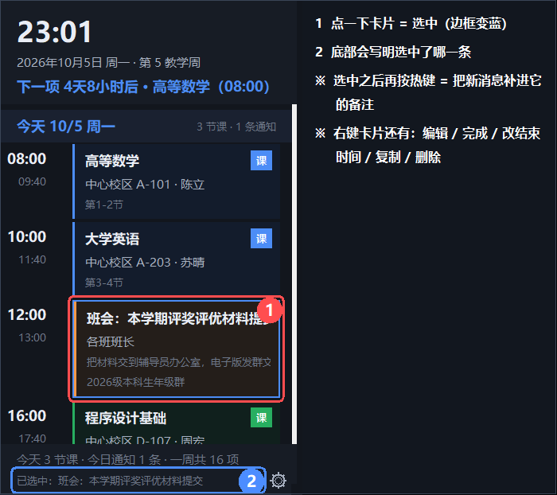

- 补充内容**原样**并进去，原来的备注不会被冲掉
- 短句用「；」接在后面，多行或较长的补充另起一行
- **再点一下同一张卡片就取消选中**（跟着开的详情窗也会一起关掉）
- 这条规则**只对通知生效**：课程卡片点不上（会明确提示）

### 6.2 改一条通知长什么样


日期用的是三段输入框（年 / 月 / 日各一格），中间那个短横线是**分隔符，删不掉**。
填错不会关窗，下面用红字说明哪里不对。

---

## 7. 上课时间与节数

控制台 →「上课时间」页。

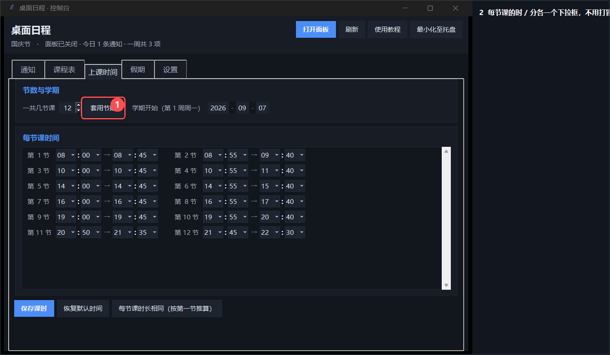

| 项 | 说明 |
| --- | --- |
| **一共几节课** | 1~24 节，改完点「套用节数」，下面的输入框会重排（**已填的时间会带过去**） |
| 每节的开始 / 结束 | 时、分各一个下拉框，**不用打冒号** |
| **学期开始（第 1 周周一）** | 三段式日期框；周次按它算；填成非周一会被提示并自动校准 |
| **保存课时** | 保存并让面板按新时间重排 |
| **恢复默认时间** | 回到内置课时 |
| **每节课时长相同** | 按第一节的时长把后面每节推平 |

写错了会被拦住：下课时间不早于上课时间、中间不能空一节。

---

## 8. 假期、调休与节日彩蛋

控制台 →「假期」页。这一页解决三件事：**放假不排课**、**调休要补课**、**过节有点气氛**。

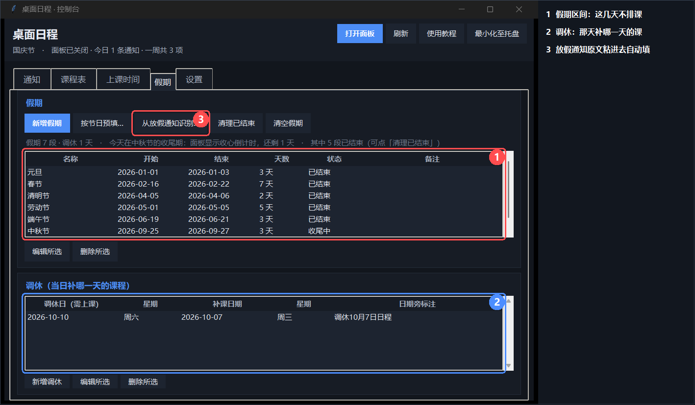

### 8.1 假期：这几天不排课，但群通知照收

| 字段 | 说明 |
| --- | --- |
| 名称 | 只是给你自己看的标签。**节日彩蛋按日期判定，不认这个名字** |
| 开始 / 结束 | 三段式日期输入 |

假期里**一门课都不排**，但**群通知照常显示**——放假期间老师照样发通知，这条是特意要的。

假期表有一列**状态**：`未开始` / `进行中` / `收尾中` / `已结束`。
假期到点**自动失效**，不用手动删；历史条目可以用「清理已结束」一键收掉。

四个按钮：

| 按钮 | 做什么 |
| --- | --- |
| **新增假期** | 手动加一段；双击表格里的行也能改 |
| **按节日预填…** | 按"节日当天 + 常见连休天数"铺一份**草稿**（结果是推算，**以学校通知为准**） |
| **从放假通知识别…** | 把放假通知**原文**粘进去，自动识别假期区间与调休日 |
| **清理已结束** | 把已经过去的假期删掉 |

### 8.2 假期结束后的收心倒计时

假期一结束，面板自动回到正常排课；**紧接着的三天**会在日期下方多一条提示：

```
✦ 国庆节假期已结束 · 收心倒计时 3 天
```

第四天起自动消失。

### 8.3 调休：那一天补哪一天的课

调休窗是"一行一组"：左边**调休日**（当天要上课），右边**补课日期**（补哪一天）。
例：`10月10日（周六）补 10月7日（周三）的课`。

面板那天的日期旁边会多一行小字：

```
今天 10/10 周六   调休10月7日日程        4 节课
```

这行字默认是 **「调休X月X日日程」** 的格式，也能自己在窗里改成别的说法。

### 8.4 节日彩蛋

**触发条件**（越靠前越优先）：

1. 节日当天
2. `data\calendar.json` 里**包含这个节日日期**的假期区间内
3. 节日**前后各 3 天**
4. 假期刚结束的收尾期

**只看日期，不看假期叫什么名字**：你把假期写成「中秋国庆连放」也好、改成「放假」也好，
效果完全一样。

一个区间里包含多个节日时（典型是两个节并成一条），**按各节日自己的天数分段**：

| 日期 | 面板 |
| --- | --- |
| 9/22–9/24 | 中秋节（还有 3/2/1 天） |
| 9/25 | 中秋节 |
| 9/26–9/30 | **没有彩蛋**（中秋已过、国庆未到） |
| 10/1–10/7 | 国庆节 |
| 10/8–10/10 | 国庆节（收心倒计时） |

有彩蛋的日子，面板顶部会多一条横幅：节日配色 + 装饰 + 一句祝福。
**点一下横幅**展开该节日的彩蛋文案（再点收起）。面板边框也会换成节日主色并慢慢"呼吸"。

彩蛋覆盖 **农历 1900–2100 年**（春节、元宵、端午、中秋按农历，清明按节气，
由随程序附带的农历库算）。

### 8.5 面板上跟日期有关的两处

- 顶部日期行**带年份**：`2026年9月25日 周五 · 第 3 教学周`
- 跨年期间写成 `2027/1/1`，年份一目了然

---

## 9. 设置项逐个说明

控制台 →「设置」页。**这一页只有功能名称**，说明都在这儿。

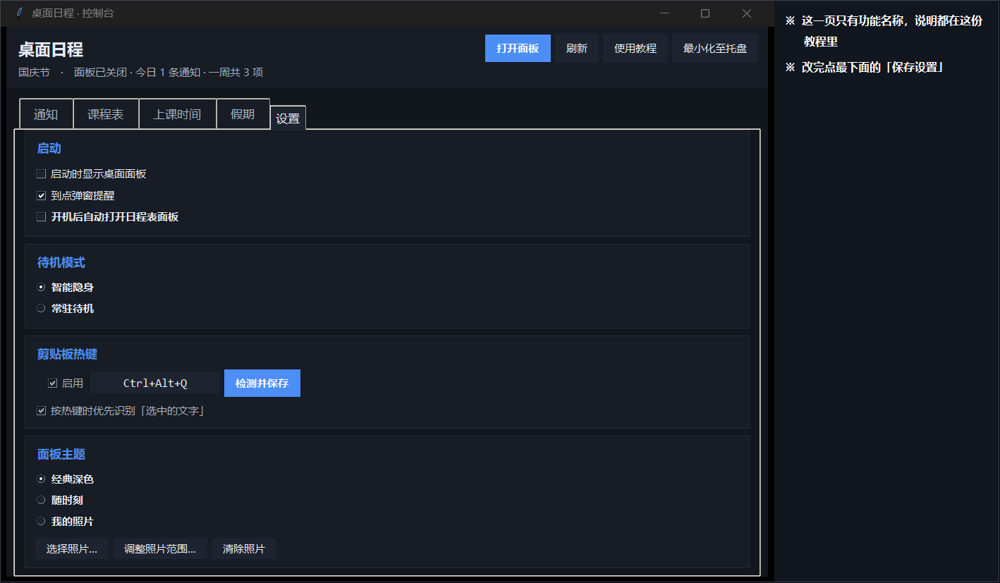

| 设置 | 说明 | 建议 |
| --- | --- | --- |
| **启动时显示桌面面板** | 下次启动是否自动拉起面板 | 开 |
| **到点弹窗提醒** | 事项开始前弹个小窗 | 开 |
| **待机模式** | **智能隐身**＝检测到全屏应用（游戏/视频）时自动让位，切回桌面立刻恢复；**常驻待机**＝全屏时面板也不隐藏，一直在屏幕上 | 智能隐身 |
| **剪贴板热键** | 是否启用、用哪个组合；「按热键时优先识别「选中的文字」」关掉后只读剪贴板 | 开，`Ctrl+Alt+Q` |
| **面板主题** | 三选一，见下 | 经典深色 |
| **开机自启动** | 勾上＝登录后自动打开日程表**面板**（不开控制台） | 按需 |
| **保存设置** | 改完点它 | — |

### 9.1 面板主题（三种）

| 模式 | 效果 |
| --- | --- |
| **经典深色** | 固定配色，不随时间变化（默认） |
| **随时刻** | 配色跟着天色走：清晨（05–09）/ 白天（09–17）/ 黄昏（17–20）/ 深夜（20–05）四套，跨过时段自己换；**标题区是一条渐变**——清晨是日出（天蓝 → 暖金）、白天是正午（淡蓝 → 近白）、黄昏是日落（紫 → 橙）、深夜是夜空（深蓝 → 近黑） |
| **我的照片** | 用你自己的照片：照片铺在面板顶部，整套配色由照片取色生成，**文字颜色按背景明暗自动切换** |

比如黄昏（日落）：上面是紫、往下化进橙，正文仍然是暗色卡片、白字，看得清。

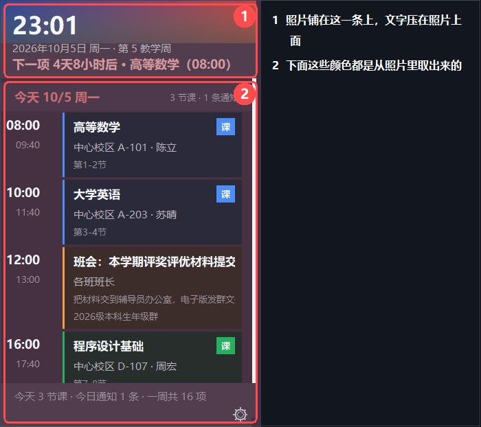

**换照片**：「我的照片」→「选择照片…」→ 选文件 → **框选显示范围** → 保存。
支持 JPG / PNG / BMP / GIF，会转存到 `data\theme\` 下，**不引用原图**（原图挪走也没事）。

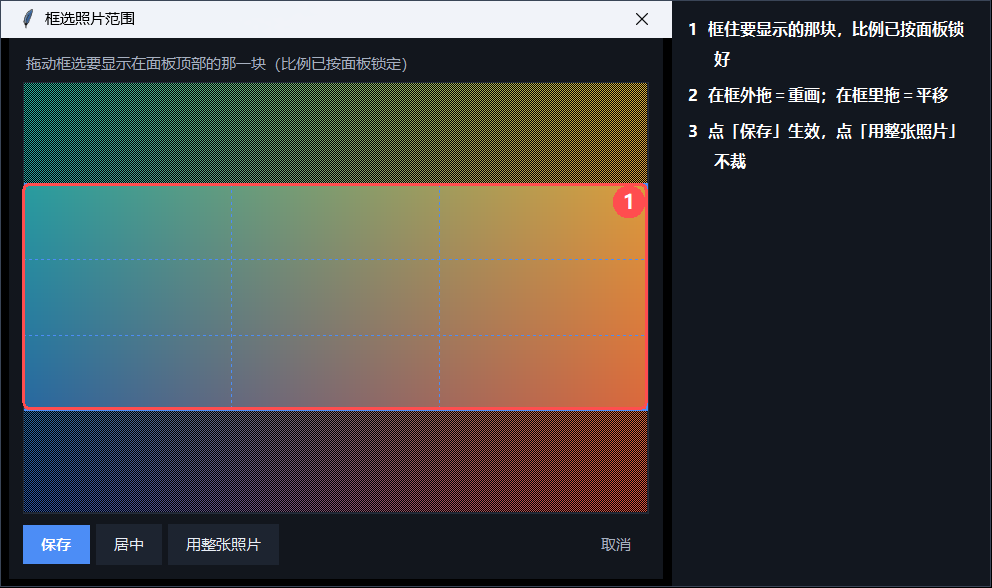

- 框的宽高比**按面板锁死**，所以你框到的就是最终看到的那一条
- 框**外面**拖＝重画；框**里面**拖＝平移；「居中」回到最大居中框
- 想用整张就点「用整张照片」
- 选过之后随时能点 **「调整照片范围…」** 重框（程序留了一份未裁的原图）
- **「清除照片」** 移除

### 9.2 开机自启动

勾上 **「开机后自动打开日程表面板」**，立刻生效，不用保存、不用重启。

**只开面板，不开控制台**——这条是固定的，界面上没有开关。
（登录后只出现桌面右边那条日程表；控制台要你明确再要一次。）

实现方式是在「启动」文件夹放一个快捷方式，指向 `tools\launch-panel.vbs`，
不需要管理员权限、不写注册表。**你自己删掉那个快捷方式，设置页的勾也会跟着取消**。
想彻底撤掉，取消勾选，或跑 `tools\uninstall.cmd`。

---

## 10. 窗口找不到了怎么办

**双击桌面上的「桌面日程」快捷方式**：面板会立刻出现在屏幕上，并且**临时跳到所有窗口
最上面 3 秒**（浏览器开着也不怕被盖住），3 秒后回到它平时待的桌面层。

> 为什么要"临时"跳上来：面板平时是**桌面挂件**，压在普通窗口之下。不跳上来的话，
> 你双击了快捷方式却什么也看不到 —— 会以为是"点了没反应"（真有人这么报过）。

**托盘图标（屏幕右下角通知区）一直都在**：只要程序在跑 —— 哪怕只开了日程表面板 ——
那里就有「桌面日程」的图标。

* **双击**它 → 把控制台窗口叫到最前面（并让任务栏按钮闪一下）；控制台没开就顺手开一个。
* **右键**它 → 「呼出客户端窗口 / 快速录入群消息… / 打开桌面面板 / 收起桌面面板 /
  立即整合群通知 / 退出应用」。

> 点它没反应？那多半是个**残留图标**：程序被强杀（任务管理器结束进程、或崩溃）时，
> Windows 会把这个图标留在通知区，直到你把鼠标移上去或重启资源管理器。
> 把鼠标在它上面停一下就会消失，然后再从桌面快捷方式正常启动一次即可。

### 控制台不见了

它可能被最小化至托盘了（进程还在）。两种办法叫回来：

| 办法 | 怎么做 |
| --- | --- |
| **点面板右下角 ⚙** | 齿轮菜单里有「打开客户端窗口」 |
| **托盘图标** | 双击图标，或右键 →「呼出客户端窗口」 |

### 面板不见了

| 情况 | 处理 |
| --- | --- |
| 有全屏应用在前台 | 正常（智能隐身在起作用），切出来就回来 |
| 曾手动收起 | 双击桌面快捷方式——它会把面板叫回眼前 |
| 面板进程真的退了 | 同上：双击桌面快捷方式会重新拉起它 |
| 就是不出来 | 命令行跑 `runtime\python.exe main.py --panel`，再看 `data\panel.log` |

### 关掉控制台不等于关掉日程表

点控制台右上角的 `X` **只是把它最小化至托盘**：日程表继续显示、通知照收、到点提醒照弹。

**完全退出**只有两个入口（都会把面板和托盘一起退干净）：

| 入口 | 位置 |
| --- | --- |
| **退出应用** | 托盘图标右键 |
| **退出应用（面板与托盘一并退出）** | 面板右下角 **⚙** 菜单最后一项，或右键底部状态行 |

### 托盘图标右键菜单

| 菜单项 | 做什么 |
| --- | --- |
| **呼出客户端窗口** | 把控制台叫到最前面 |
| **快速录入群消息…** | 叫出控制台、切到「通知」页，粘上就能存 |
| **打开桌面面板 / 收起桌面面板** | 开关桌面那条日程表 |
| **立即整合群通知** | 立刻整合一次 `data\inbox` |
| **退出应用** | 面板 + 托盘一起退干净 |

---

## 11. 数据在哪、怎么备份、怎么恢复

全部在 `data\` 目录，**都是能直接看的 JSON**：

| 文件 | 是什么 |
| --- | --- |
| `events.json` | 一周内的通知（日程本体） |
| `timetable.json` | 课程表 + 课时表 + 学期开始 |
| `calendar.json` | 假期区间 + 调休 |
| `client.json` | 设置 |
| `state.json` | 上次整合的时间与摘要 |
| `inbox\` | 待整合的群消息（丢这里会被处理） |
| `archive\` | 整合过的原始文件 |
| `theme\` | 你选的背景照片 |
| `panel.log` | 出错时的日志（**正常时是空的**） |

- **备份**：整个 `data\` 拷走就是完整备份。
- **恢复**：拷回来覆盖。
- **清理**：删 `events.json` 清空通知；删 `timetable.json` 清空课表。
- **自动备份**：每次导入/保存课表都写 `timetable.json.bak`（「撤销上次导入」用它）。

> **这个目录别分享给别人**：里面有你的课表和通知。发给朋友的是程序目录，不是 `data\`。

---

## 12. 常见问题

| 现象 | 处理 |
| --- | --- |
| **双击快捷方式没反应** | 日程表可能已经在跑了——这时它会把面板叫到眼前。要控制台请点面板右下角 ⚙ |
| **控制台打不开** | 它可能已最小化至托盘：双击托盘图标，或点面板 ⚙ →「打开客户端窗口」 |
| 面板点不动 | 检查 `data\client.json` 里 `"click_through"` 是不是被手改成了 `true`，改回 `false` 再重启面板 |
| 面板被别的窗口挡住 | 它是桌面层窗口，属正常；想始终在最前，把 `client.json` 的 `"window_mode"` 改成 `"topmost"` |
| 按 `Win+D` 后面板消失 | 检查 `client.json` 里 `"pet_mode"` 是不是被改成了 `false`（默认 `true`） |
| 游戏里被挡 | 设置 → 待机模式 → 选「智能隐身」 |
| 放假了还在排课 | 「假期」页加一段假期，或把放假通知粘进去让它自己认 |
| 调休那天显示平时的课 | 「假期」页下面加一条调休：调休日 + 补哪天的课 |
| 节日当天没有彩蛋 | 当天必定出现（按内置农历算）。想让整个假期都有气氛，就加一段**包含节日当天**的区间 |
| 文件提示「未能识别课表」 | 命令行看一眼：`runtime\python.exe -m agenda.file_import 你的文件`，会打印读到的内容和卡在哪一步 |
| 周次和教务不一样 | 在确认窗顶部改「第 1 教学周周一」 |
| 读到的课缺老师/地点 | 确认窗里双击补上 |
| 通知标题粘了半句话 | 已修：现在会在「事项名：说明」的冒号处截断。还有问题请把原文发我 |
| 拖入文件没反应 | 确认拖的是文件或文件夹（不是选中的文字） |
| 面板滚动卡 | 已优化（卡片控件复用）。仍卡请反馈通知数量 |
| 需要适配别的学校 | 跑 `runtime\python.exe tools\probe_schools.py` 看那个学校的入口形态 |

---

## 13. 命令行参数

一般用不到，排错和自动化时有用（`runtime\python.exe` 是项目自带的 Python）：

```powershell
runtime\python.exe main.py --shortcut               # 桌面快捷方式入口：只开面板
runtime\python.exe main.py --panel                  # 只开面板（开机自启动走这条）
runtime\python.exe main.py --client --start-panel   # 控制台 + 面板
runtime\python.exe main.py --tutorial               # 打开这份教程（窗口版）
runtime\python.exe main.py --tutorial-web           # 生成网页版教程并用浏览器打开
runtime\python.exe main.py --status                 # 命令行看一周日程
runtime\python.exe main.py --once                   # 整合 inbox 一次
runtime\python.exe main.py --check-timetable        # 逐条列出读到的课
runtime\python.exe main.py --paste --group 班群      # 从 stdin 粘一条通知
runtime\python.exe main.py --list-schools           # 看已登记的学校
runtime\python.exe -m agenda.file_import 课表.ics    # 单独试文件识别
runtime\python.exe -m unittest discover -s tests -t .   # 跑测试
```

其它开关：`--width`、`--refresh`、`--pipeline-minutes`、`--window-mode`、
`--no-click-through`、`--always-visible`、`--no-pet-mode`、`--panel-x/--panel-y`、`--data-dir`。

**重新生成这份教程里的配图**（改了界面之后）：

```powershell
runtime\python.exe tools\capture_tutorial.py
```

---

## 还想更深入？

- `README.md` —— 面向开发者：架构、扩展点、每个实现选择的实测证据
- `docs/school-reachability.md` —— 四所学校入口的实测记录
- `data\` —— 你的数据，都是明文 JSON，可以直接编辑
